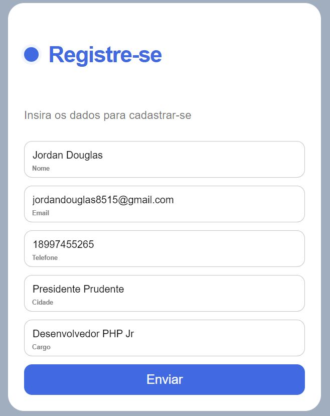

## Sobre este projeto

Observe que esse projeto foi desenvolvido para funcionar utilizando a framework Laravel, e para garantir o funcionamento do mesmo, recomendo se atentar 
 ao conteúdo desse readme com as considerações a seguir:

- Certifiique-se de iniciar o composer corretamente para adicionar o diretório "vendor".
- Verifique se existe disponível a conexão com banco MySql, você pode ver as configurações no arquivo "./.env".
- Adicione um novo "db" no MySql com o nome "laravel".
- Inicie o "php artisan serve".
- Acesse o projeto clicando [http://localhost:8000/clientes/create](http://localhost:8000/clientes/create).

## Fluxo de telas
###  - Sem dados

###  - Com dados

###  - Caso sucesso

###  - Caso Falha

<h3 align="center" > Entre em contato acessando: </h3>
 

        
        
		
    
    
      

